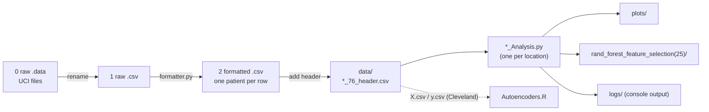

<div align="center">

# Heart Disease Risk Factors

**Compares risk factors for heart disease across the four locations of the UCI Heart Disease dataset**


[](https://github.com/HuberNicolas/heart-disease-risk-factors-uzh/actions/workflows/reproduce.yml)

[Quick start](#quick-start) · [Results](#results) · [Report (PDF)](submission/report.pdf) · [Slides (PDF)](submission/presentation.pdf)

</div>

Group project for the course *Introduction to Data Science* at the University of Zurich, spring semester 2021. We
used all 76 attributes of the UCI Heart Disease dataset instead of the usual 14 and ran the same pipeline on each of
the four locations (Cleveland, Hungary, Switzerland, Long Beach VA) to answer three questions:

1. Are some parameters more likely to be associated with heart disease?
2. Are there differences between the locations?
3. Can the different levels of heart disease (`num` 0–4) be told apart?

## Features

- 🧹 Parses the raw 76-attribute files, where one patient spans several lines, into one CSV per location
- 📊 Exploratory plots: heart rate, cholesterol and blood pressure against age and target, correlations, age and sex distributions
- 🌲 Feature selection with a random forest (top 25 features)
- 🗺️ Dimensionality reduction with t-SNE, UMAP and an autoencoder (R/Keras)
- 🤖 Classification with logistic regression, naive Bayes, SVM (linear, polynomial, RBF), KNN and a small neural network, with confusion matrices and ROC curves

> [!NOTE]
> This is a student project from 2021, our first steps in data science. The code is kept as submitted: the
> dependencies are pinned to May 2021 and the analysis is not developed further in the `v1.x` releases. The
> submitted state is tagged [`v1.0.0`](https://github.com/HuberNicolas/heart-disease-risk-factors-uzh/releases/tag/v1.0.0).

## Contents

- [Tech stack](#tech-stack)
- [Pipeline](#pipeline)
- [Repository structure](#repository-structure)
- [Quick start](#quick-start)
- [Results](#results)
- [Data](#data)
- [Development](#development)
- [Documentation](#documentation)
- [Known issues](#known-issues)
- [Authors](#authors)
- [Acknowledgements](#acknowledgements)
- [License](#license)

## Tech stack

| Area | Technologies |
|---|---|
| Language |   |
| Data |   |
| Machine learning |     |
| Plots |    |
| Tooling |    |

## Pipeline



| Step | Where | What |
|---|---|---|
| 1 | [`0 raw .data/`](0%20raw%20.data/) | Original files from the UCI archive, with MD5 hashes |
| 2 | [`1 raw .csv/`](1%20raw%20.csv/) | The four used files renamed to `.csv`, plus [`formatter.py`](1%20raw%20.csv/formatter.py) |
| 3 | [`2 formatted .csv/`](2%20formatted%20.csv/) | One patient per row, 76 columns, no header |
| 4 | [`data/`](data/) | Same data with a header row; input of the analysis |
| 5 | `*_Analysis.py` | Preprocessing, plots, feature selection, reduction and classification for one location |

## Repository structure

| Path | Content |
|---|---|
| [`Cleveland_Analysis.py`](Cleveland_Analysis.py), [`Hungarian_Analysis.py`](Hungarian_Analysis.py), [`Switzerland_Analysis.py`](Switzerland_Analysis.py), [`Vancouver_Analysis.py`](Vancouver_Analysis.py) | Analysis per location (`Vancouver` is Long Beach VA, see [Known issues](#known-issues)) |
| [`Autoencoders.R`](Autoencoders.R) | Autoencoder for the 2D/3D reduction of the 25 selected features |
| [`data/`](data/) | Input CSVs with header; `X.csv`/`y.csv` are the Cleveland features and target for the R script |
| [`rand_forest_feature_selection(25)/`](rand_forest_feature_selection(25)/) | The 25 features selected by the random forest, per location |
| [`plots/`](plots/) | Plots from the run in May 2021, numbered as in the report |
| [`logs/`](logs/) | Console output of the four scripts from May 2021 |
| [`accuracies.xlsx`](accuracies.xlsx) | Accuracy table of all classifiers |
| [`submission/`](submission/) | Report and slides as submitted, poll questions from the presentation |
| [`docs/`](docs/) | Documentation, including the report as Markdown |

## Quick start

TensorFlow 2.4 has wheels for x86_64 only and needs a CPU with AVX. It does not run on Apple Silicon, not even
through Rosetta or Docker. Use x86_64 Linux or Windows, or let the [Reproduce](.github/workflows/reproduce.yml)
workflow run the scripts.

Prerequisites: [uv](https://docs.astral.sh/uv/). uv installs Python 3.8 if it is missing.

1. Install the locked dependencies:

   ```bash
   uv sync
   ```

2. Run the analysis for one location from the repository root. The script overwrites the plots in `plots/` and the
   CSVs in `rand_forest_feature_selection(25)/`:

   ```bash
   uv run python Cleveland_Analysis.py
   ```

   The other locations work the same way (`Hungarian_Analysis.py`, `Switzerland_Analysis.py`,
   `Vancouver_Analysis.py`). Set `MPLBACKEND=Agg` to save the plots without opening windows.

3. Optional, the autoencoder in R (not tested again, see [Known issues](#known-issues)): install the R packages
   `tensorflow`, `keras`, `caTools`, `dplyr`, `ggplot2` and `plotly`, then run the script from `data/`, where it
   reads `X.csv` and `y.csv`.

## Results

Accuracy on the test set (25 %, `random_state=101`), from the report:

| Classifier | Cleveland | Hungary | Long Beach VA | Switzerland |
|---|---|---|---|---|
| Logistic regression | 0.84 | 0.59 | 0.74 | 0.65 |
| Naive Bayes | 0.77 | 0.46 | 0.54 | – |
| SVM, linear | 0.86 | 0.58 | 0.84 | – |
| SVM, polynomial (degree 3) | 0.68 | 0.62 | 0.38 | – |
| SVM, RBF | 0.58 | 0.62 | 0.20 | – |
| KNN (k = 5) | 0.73 | 0.57 | 0.46 | 0.42 |
| Neural network | 0.48 | 0.42 | 0.08 | 0.23 |

The full discussion, the top features per location and the conclusion are in the
[report](docs/report.md).

## Data

| Source | License | Included |
|---|---|---|
| [UCI Heart Disease](https://archive.ics.uci.edu/dataset/45/heart+disease) (Janosi, Steinbrunn, Pfisterer, Detrano, 1989) | [CC BY 4.0](https://creativecommons.org/licenses/by/4.0/) | Yes, the whole archive folder in `0 raw .data/` |

The pipeline uses `cleveland.data`, `hungarian.data`, `switzerland.data` and `long-beach-va.data`. The other files of
the archive are included for completeness. See [docs/dataset.md](docs/dataset.md) for the attributes, the class
distribution and the MD5 hashes.

> [!WARNING]
> `0 raw .data/new.data` is part of the original UCI archive and contains the last names of patients. It is not
> used by this project.

## Development

| Task | Command |
|---|---|
| Install dependencies | `uv sync` |
| Lint | `uvx ruff check .` |
| Format | `uvx ruff format .` |
| Run one location | `uv run python Cleveland_Analysis.py` |

The lock file resolves the packages as of the submission date (`exclude-newer = 2021-05-24` in
[`pyproject.toml`](pyproject.toml)).

## Documentation

| Guide | Content |
|---|---|
| [docs/report.md](docs/report.md) | Project report as submitted (Markdown version of [`submission/report.pdf`](submission/report.pdf)) |
| [docs/dataset.md](docs/dataset.md) | Data source, used files, preprocessing, hashes |
| [submission/presentation.pdf](submission/presentation.pdf) | Slides of the final presentation |

## Known issues

- **„Vancouver“ is Long Beach VA.** The scripts and plots call the Long Beach dataset `Vancouver`; VA stands for the
  V.A. Medical Center in Long Beach, California. The names are kept as submitted.
- **Cleveland has 282 of 303 patients.** `cleveland.data` in the UCI archive is partly corrupted (see
  `0 raw .data/WARNING`), and the preprocessing keeps 282 patients.
- **Four copies of one script.** The analysis scripts are nearly identical and differ in the input file and small
  location-specific changes (for example, the Swiss data has no cholesterol values and too few samples per class for
  some ROC curves).
- **Not reproducible to the digit.** The random forest and the neural network have no fixed seed, so reruns select
  slightly different features and give different accuracies. A rerun in 2026 with the locked versions gave, for
  example, 0.83 instead of 0.84 for logistic regression on Cleveland.
- **Mixed-case plot names.** `Vancouver_Analysis.py` saves `plots/vancouver_*.png`, while most committed plots from
  2021 are named `Vancouver_*.png`. On case-sensitive file systems a rerun adds new files instead of replacing them.
- **Patient ID and dates as features.** The random forest selects `id` and `cday` for some locations; the report
  discusses this.
- **R autoencoder not tested again.** It needs R with the `keras` and `tensorflow` packages and a matching Python
  TensorFlow; it reads `X.csv`/`y.csv` from the working directory.
- **Apple Silicon.** TensorFlow 2.4 does not run there (see [Quick start](#quick-start)).

## Authors

- Kalvin Dobler ([@KalvinDobler](https://github.com/KalvinDobler))
- Nathalie Guttmann
- Nicolas Huber ([@HuberNicolas](https://github.com/HuberNicolas))

Course project, *Introduction to Data Science*, University of Zurich, spring semester 2021.

## Acknowledgements

The data was collected by Andras Janosi, M.D. (Hungarian Institute of Cardiology, Budapest), William Steinbrunn, M.D.
(University Hospital Zurich), Matthias Pfisterer, M.D. (University Hospital Basel) and Robert Detrano, M.D., Ph.D.
(V.A. Medical Center Long Beach and Cleveland Clinic Foundation), and donated to the UCI Machine Learning Repository by
David W. Aha. As requested by the authors, please cite:

> Janosi, A., Steinbrunn, W., Pfisterer, M., & Detrano, R. (1989). *Heart Disease* [Dataset]. UCI Machine Learning
> Repository. https://doi.org/10.24432/C52P4X

## License

The code, the report and the slides are licensed under the [MIT License](LICENSE). The UCI Heart Disease data in
`0 raw .data/` and the files derived from it keep their own license, [CC BY 4.0](https://creativecommons.org/licenses/by/4.0/).
