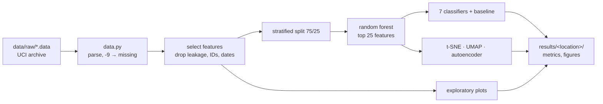

<div align="center">

# Heart Disease Risk Factors

**Compares risk factors for heart disease across the four locations of the UCI Heart Disease dataset**


[](https://github.com/HuberNicolas/heart-disease-risk-factors-uzh/actions/workflows/ci.yml)

[Quick start](#quick-start) · [Results](#results) · [Methodology](docs/methodology.md) · [Original project (v1)](https://github.com/HuberNicolas/heart-disease-risk-factors-uzh/tree/v1.1.0)

</div>

The UCI Heart Disease dataset has records from four hospitals with 76 attributes each; most studies use only 14 of
them and only the Cleveland data. This project uses all attributes of all four locations and runs the same pipeline
on each one to answer three questions:

1. Are some parameters more likely to be associated with heart disease?
2. Are there differences between the locations?
3. Can the different levels of heart disease (`num` 0–4) be told apart?

## Features

- 🧹 Reads the raw archive files directly, one patient per row, all 76 attributes
- 🚫 Excludes attributes that leak the diagnosis (angiography results), identifiers and dates by default
- 📊 Exploratory plots: heart rate, cholesterol and blood pressure against age and diagnosis, correlations, age and sex
- 🌲 Feature selection with a random forest
- 🗺️ Two-dimensional embeddings with t-SNE, UMAP and an autoencoder
- 🤖 Seven classifiers against a majority-class baseline, with test accuracy, balanced accuracy, ROC AUC and cross-validation
- 🔁 Fixed seeds: the same command gives the same numbers on the same platform

> [!NOTE]
> This started as a group project for *Introduction to Data Science* at the University of Zurich in spring 2021, our
> first steps in data science. Version 2 is a rewrite of the analysis as a Python package. The code as submitted is
> tagged [`v1.0.0`](https://github.com/HuberNicolas/heart-disease-risk-factors-uzh/releases/tag/v1.0.0), and a
> runnable version with the original dependencies is [`v1.1.0`](https://github.com/HuberNicolas/heart-disease-risk-factors-uzh/tree/v1.1.0).

## Contents

- [Tech stack](#tech-stack)
- [Pipeline](#pipeline)
- [Repository structure](#repository-structure)
- [Quick start](#quick-start)
- [Results](#results)
- [Data](#data)
- [Development](#development)
- [Documentation](#documentation)
- [Known issues](#known-issues)
- [Authors](#authors)
- [Acknowledgements](#acknowledgements)
- [License](#license)

## Tech stack

| Area | Technologies |
|---|---|
| Language |  |
| Data |   |
| Machine learning |   |
| Plots |   |
| Tooling |     |

## Pipeline



| Module | Content |
|---|---|
| [`data.py`](src/heart_disease/data.py) | Attribute list, parser for the raw files, feature groups and selection |
| [`analysis.py`](src/heart_disease/analysis.py) | Split, feature importance, classifiers, evaluation, embeddings |
| [`plots.py`](src/heart_disease/plots.py) | The figures, one PNG each |
| [`pipeline.py`](src/heart_disease/pipeline.py) | Runs everything for one location and writes the results |
| [`cli.py`](src/heart_disease/cli.py) | `heart-disease run` and `heart-disease info` |

## Repository structure

| Path | Content |
|---|---|
| [`src/heart_disease/`](src/heart_disease/) | The package |
| [`tests/`](tests/) | pytest tests for the parser, feature selection and pipeline |
| [`data/raw/`](data/raw/) | The UCI Heart Disease archive folder as downloaded in 2021, with MD5 hashes |
| [`docs/`](docs/) | Methodology, dataset and the report of 2021 |
| [`submission/`](submission/) | Report, slides, accuracy table and poll of the 2021 submission |
| `results/` | Output of `heart-disease run` (not committed) |

## Quick start

Prerequisites: [uv](https://docs.astral.sh/uv/). It installs a suitable Python if needed.

1. Install the package and its dependencies:

   ```bash
   uv sync
   ```

2. Show patients, features and class distribution per location:

   ```bash
   uv run heart-disease info
   ```

3. Run the analysis for all four locations (about a minute). Results go to `results/`:

   ```bash
   uv run heart-disease run
   ```

4. Or one location, without the slower embeddings:

   ```bash
   uv run heart-disease run -l cleveland --skip-embeddings
   ```

| Option | Default | Meaning |
|---|---|---|
| `-l`, `--location` | all | `cleveland`, `hungary`, `switzerland` or `long-beach-va`; repeatable |
| `-o`, `--output` | `results` | Output folder (`run` only) |
| `--seed` | `0` | Random seed for split, models and embeddings (`run` only) |
| `--top-k` | `25` | Number of features the random forest selects (`run` only) |
| `--skip-embeddings` | off | Skip t-SNE, UMAP and the autoencoder (`run` only) |
| `--original-features` | off | Use the feature set of 2021, including angiography results, patient ID and dates |

Each location gets a folder `results/<location>/` with `metrics.csv`, `feature_importance.csv`, `summary.json` and
`figures/`; `results/accuracy.md` compares the test accuracy of all locations.

## Results

Test accuracy (25 % of the patients, seed 0) with the default features, from the CI run on Linux. The baseline
always predicts the most frequent class:

| Model | Cleveland | Hungary | Switzerland | Long Beach VA |
|---|---|---|---|---|
| Majority class (baseline) | 0.55 | 0.64 | 0.39 | 0.28 |
| Logistic regression | 0.65 | 0.58 | 0.32 | 0.40 |
| Naive Bayes | 0.65 | 0.50 | 0.26 | 0.28 |
| SVM, linear | 0.63 | 0.68 | 0.42 | 0.28 |
| SVM, polynomial (degree 3) | 0.56 | 0.61 | 0.35 | 0.34 |
| SVM, RBF | 0.59 | 0.64 | 0.39 | 0.28 |
| KNN (k = 5) | 0.59 | 0.66 | 0.29 | 0.30 |
| Neural network | 0.65 | 0.64 | 0.23 | 0.38 |

Most important features (random forest):

| Location | Top 5 |
|---|---|
| Cleveland | `thalach`, `thal`, `thaldur`, `ca`, `chol` |
| Hungary | `oldpeak`, `thalach`, `cp`, `exang`, `thalrest` |
| Switzerland | `age`, `thalach`, `trestbps`, `thalrest`, `tpeakbps` |
| Long Beach VA | `age`, `chol`, `years`, `thalach`, `tpeakbps` |

What this means, compared with 2021:

- **The high accuracies of 2021 came from target leakage.** With `--original-features`, logistic regression reaches
  0.86 on Cleveland and the top features are the vessels `laddist`, `cxmain` and `om1`. These are angiography
  results, and the diagnosis `num` is defined from them. Without them the models are barely better than the baseline.
- **Telling the five levels apart is hard** with a few hundred patients per location; the balanced accuracy is at
  most about 0.5. The maximum heart rate in the exercise test (`thalach`) is among the top features everywhere.
- **The locations differ** in their class distribution (Hungary has 64 % healthy patients, Switzerland 7 %) and in
  which features matter: exercise test results in Cleveland and Hungary, age and blood pressure in Switzerland, age and
  cholesterol in Long Beach.

See [docs/methodology.md](docs/methodology.md) for the details.

## Data

| Source | License | Included |
|---|---|---|
| [UCI Heart Disease](https://archive.ics.uci.edu/dataset/45/heart+disease) (Janosi, Steinbrunn, Pfisterer, Detrano, 1989) | [CC BY 4.0](https://creativecommons.org/licenses/by/4.0/) | Yes, the whole archive folder in `data/raw/` |

The pipeline reads `cleveland.data`, `hungarian.data`, `switzerland.data` and `long-beach-va.data`. See
[docs/dataset.md](docs/dataset.md) for the attributes, the class distribution and the hashes.

> [!WARNING]
> `data/raw/new.data` is part of the original UCI archive and contains the last names of patients. It is not used by
> this project.

## Development

| Task | Command |
|---|---|
| Install | `uv sync` |
| Test | `uv run pytest` |
| Lint | `uv run ruff check .` |
| Format | `uv run ruff format .` |
| Run the analysis | `uv run heart-disease run` |

CI runs lint and tests on Python 3.12 and 3.13, then the full analysis; the accuracy table appears in the job summary
and the results are uploaded as an artifact.

## Documentation

| Guide | Content |
|---|---|
| [docs/methodology.md](docs/methodology.md) | Feature groups, preprocessing, models, metrics and differences to 2021 |
| [docs/dataset.md](docs/dataset.md) | Data source, files, class distribution, hashes |
| [docs/report.md](docs/report.md) | Report of 2021 as submitted, including the attribute list |
| [submission/](submission/) | Report and slides of 2021 as PDF |

## Known issues

- **Cleveland has 282 of 303 patients.** `cleveland.data` in the UCI archive is partly corrupted (see
  `data/raw/WARNING`); the parser skips records without exactly 76 values.
- **Small classes.** Switzerland has 8 healthy patients and Cleveland 12 with `num = 4`, so test sets contain only one
  to three patients of some classes and the metrics vary with the seed.
- **Neural network differs by platform.** Its results depend on the floating-point library; on macOS the accuracy
  differs by a few points from the Linux numbers above. All other models give the same numbers.
- **Apple Silicon with an Intel Homebrew Python.** `llvmlite` (needed by UMAP) has no wheels for x86_64 macOS. Use an
  arm64 Python, for example `uv sync --python cpython-3.13-macos-aarch64-none`.

## Authors

- Kalvin Dobler ([@KalvinDobler](https://github.com/KalvinDobler))
- Nathalie Guttmann
- Nicolas Huber ([@HuberNicolas](https://github.com/HuberNicolas))

Course project, *Introduction to Data Science*, University of Zurich, spring semester 2021; rewritten in 2026.

## Acknowledgements

The data was collected by Andras Janosi, M.D. (Hungarian Institute of Cardiology, Budapest), William Steinbrunn, M.D.
(University Hospital Zurich), Matthias Pfisterer, M.D. (University Hospital Basel) and Robert Detrano, M.D., Ph.D.
(V.A. Medical Center Long Beach and Cleveland Clinic Foundation), and donated to the UCI Machine Learning Repository by
David W. Aha. As requested by the authors, please cite:

> Janosi, A., Steinbrunn, W., Pfisterer, M., & Detrano, R. (1989). *Heart Disease* [Dataset]. UCI Machine Learning
> Repository. https://doi.org/10.24432/C52P4X

## License

The code, the report and the slides are licensed under the [MIT License](LICENSE). The UCI Heart Disease data in
`data/raw/` keeps its own license, [CC BY 4.0](https://creativecommons.org/licenses/by/4.0/).
